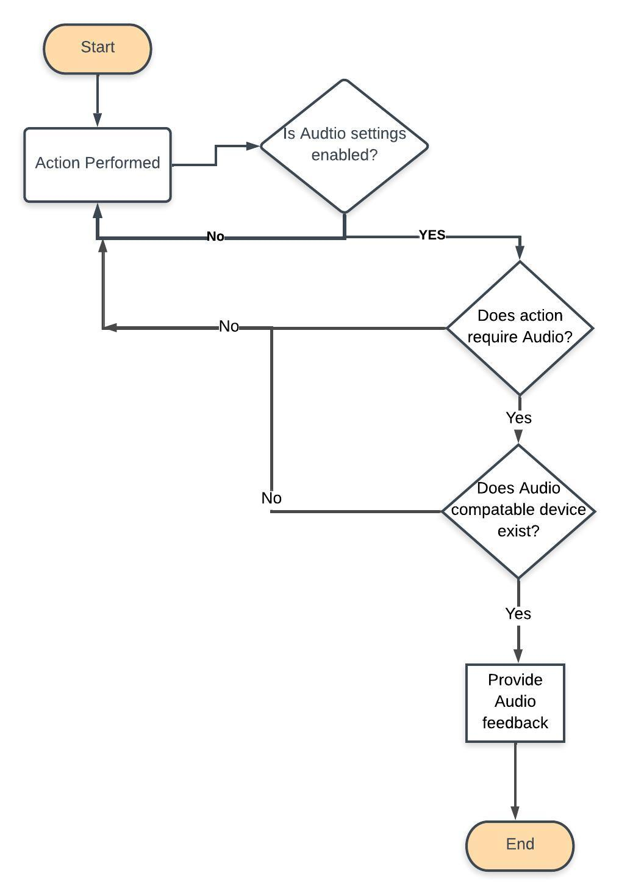
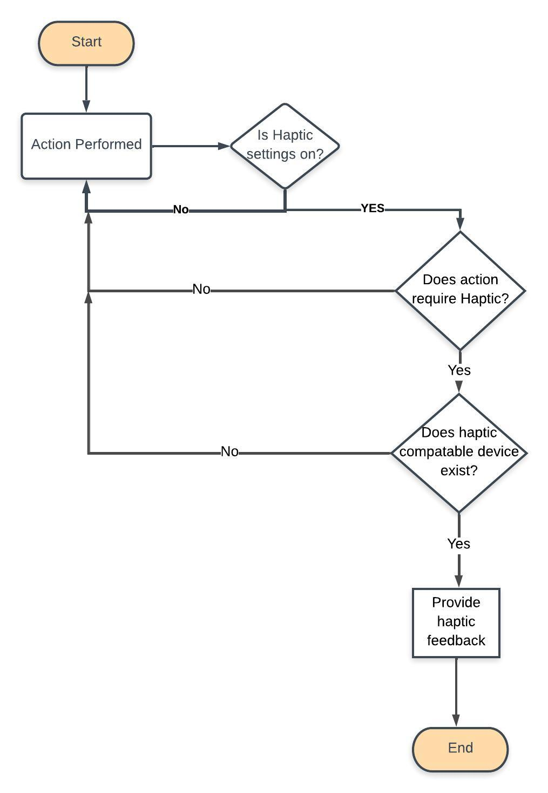
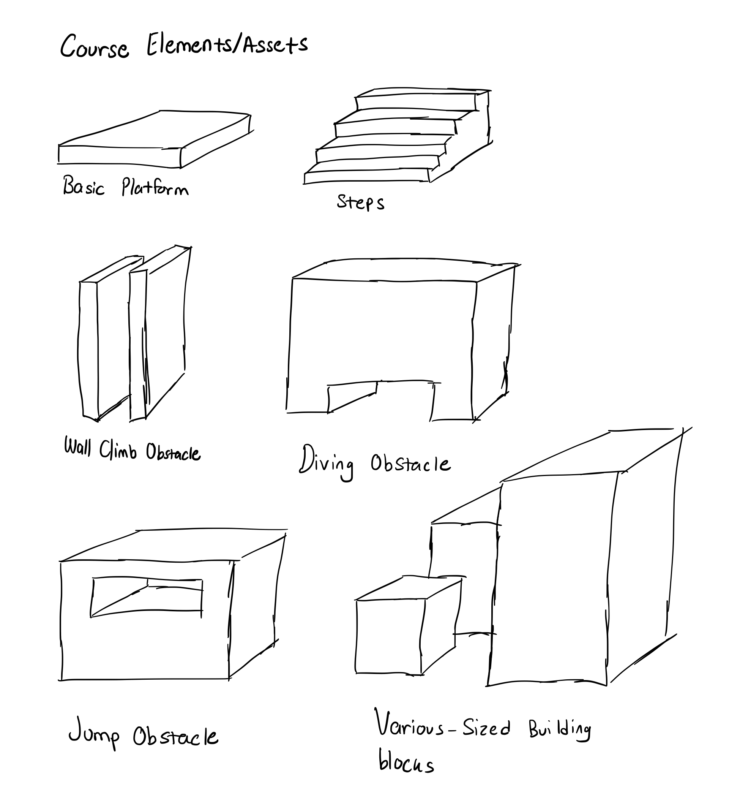
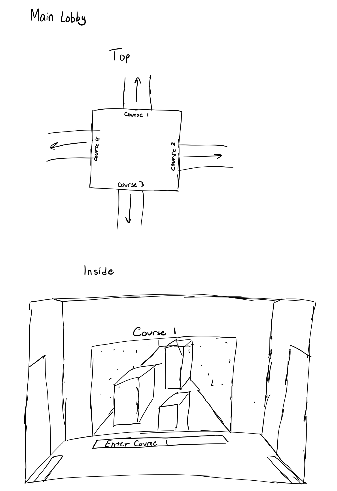
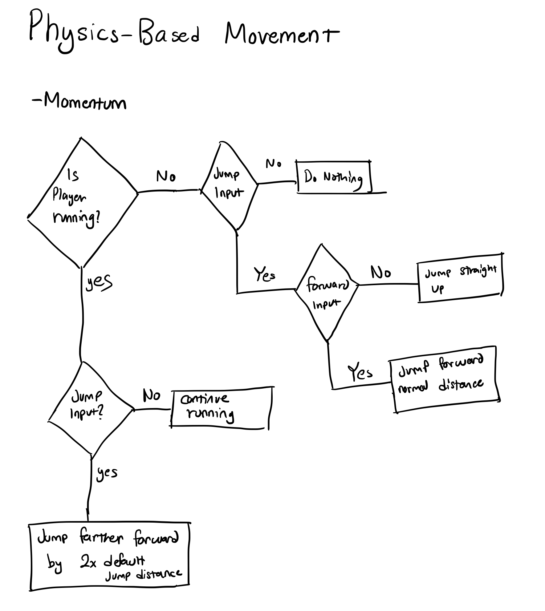

# Design Specification

### 1.2 Menu Options

-Description
### 2.2 Matchmaking System

-Description
### 3.1 & 3.2 Collision Detection

-This is the flow chart for how collision detection will be handled. The system will wait for a player input then once an input is detected it will then check if the player hit box is colliding with a wall or the platform hit boxes and will react accordingly.
### 4.1 Game Controls

-This is a flow chart for how the player movement will be handled. The system will wait for a input from the player and an input is detected it will respond accordingly depending on where the player is positioned in the game space. This will allow for fluid in-game controls.
### 5.1 Audio Feedback

-This is the flow chart for Audio Feedback. Whenever a user initiated action occures in the game, various conditions are checked to decide whether a Audio Feedback needs to be generated or not, after which haptic feedback is generated accrodingly.
### 5.2 Haptic Feedback

-This is the flow chart for Haptic Feedback. Whenever a user initiated action occures in the game, various conditions are checked to decide whether a Haptic Feedback needs to be generated or not, after which haptic feedback is generated accrodingly.

### 7.1 & 7.2 No Kill mode

### 8.1, 8.2, 9.1, 9.2 Player Data

-Description
### 10.1 & 10.2 Frontend Mock-ups

- These are bare-bones mockups of what we expect the basic platforms and obstacles to look like. Most obstacles will likely be a combination of various assets. There is also a mockup of what we expect the main lobby to look like. The player will be able to select from 4 courses in a central "hub"-like room and can proceed into any of the courses to begin.
### 11.1 Physics Based Movement

- The primary physics element the we would like to implemenet (apart from typical elements such as gravity) will be momentum. This will primarily be the mechanic that when a player jumps while running, they will go 2x farther than they would otherwise. This would be based on a particular combination of key presses. If the player is moving forward and jumps while moving, momentup mechanics will apply. If the player is stationary and jumps, they will just jump straight up. If the player jumps then moves forward, they will move forward the default jump distance.
### 11.2 Skill Progression

- As the player progresses through a course, it will require more skill to get through obstacles. Earlier stages of the courses will have easier obstacles and they will get more challeneging as the player progresses. Above are some of the easy, medium, and difficult obstacles that will be implemented.
