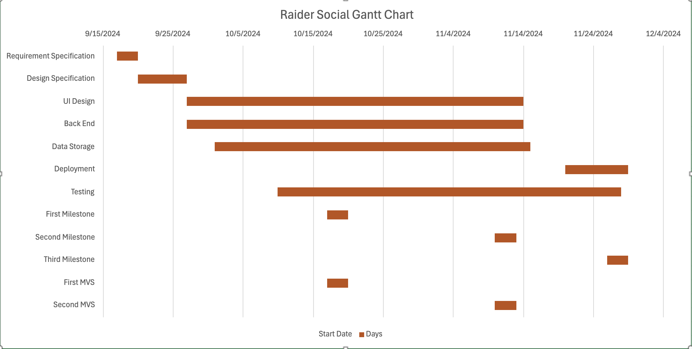

# Software Development Plan

### Communication Plan
* Meeting Location(s):
  - Discord, Classroom
* Meeting Time(s):
  - Tues/Thurs: 11:00 AM - 12:30 PM
  - Wednesday: 4:00 PM via Discord
  - Weekend as needed
* Meeting Cadence
  - Twice a week
  - Lasts about an hour or longer usually

* Communication mechanism(s) for outside of meetings
  - Discord

We anticipate on using Discord as our main line of communication and we plan on meeting there at least 2 times a week or more if needed along with meeting in class

## Timeline

  * MVSs
  * Milestones (i.e., "Checkins")
  * Requirement Specification
  * Design Specification
