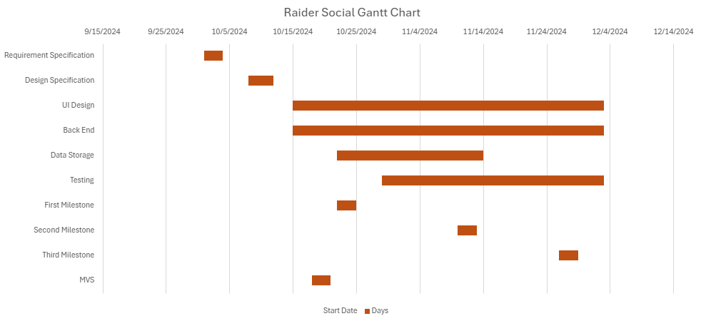

# Software Development Plan

### Communication Plan
* Meeting Location(s):
  - Discord - Most convenient platform for us to use to meet virtually
  - Classroom - Given time to meet at the end of lectures
* Meeting Time(s):
  - Tues/Thurs: 11:50 AM - 12:30 PM - Time we can meet in-person
  - Wednesday: 4:00 PM via Discord - Time all group members are free
  - Weekend as needed - If emergency/unforeseen circumstances occur 
* Meeting Cadence
  - Twice a week - We feel it is enough time to catch up with everyones progression and address any future obstacles
  - Lasts about an hour or longer usually 

* Communication mechanism(s) for outside of meetings
  - Discord

We anticipate on using Discord as our main line of communication and we plan on meeting there at least 2 times a week or more if needed.

## Timeline

  * Requirement Specification : 
    - We will be working on the Requirement Specification document from 1 Oct to 4 Oct. The document will be ready for submission on the 4th of Oct 

  * Design Specification : 
    -  We will be working on the Design Specification document right after we complete Requirement Specification from 8 Oct to 11 Oct. The document will be ready for submission on the 11th of Oct

  * Milestones : 
    - First Milestone - We will submit the for system for its First evaluation on the 20th of october 
    - Second Milestone - We will submit the for system for its Second evaluation on the 13th of November
    - Third Milestone - We will submit the for system for its Third evaluation on the 29th of November 

  * MVSs :
    - MVS - We will submit the MVS on the 20th of october 
  
  
  

## Signatures
Hayden Troxell
Tyler Wells
Adam LaDue
Immanuel Sabwami
Dipesh Paneru
